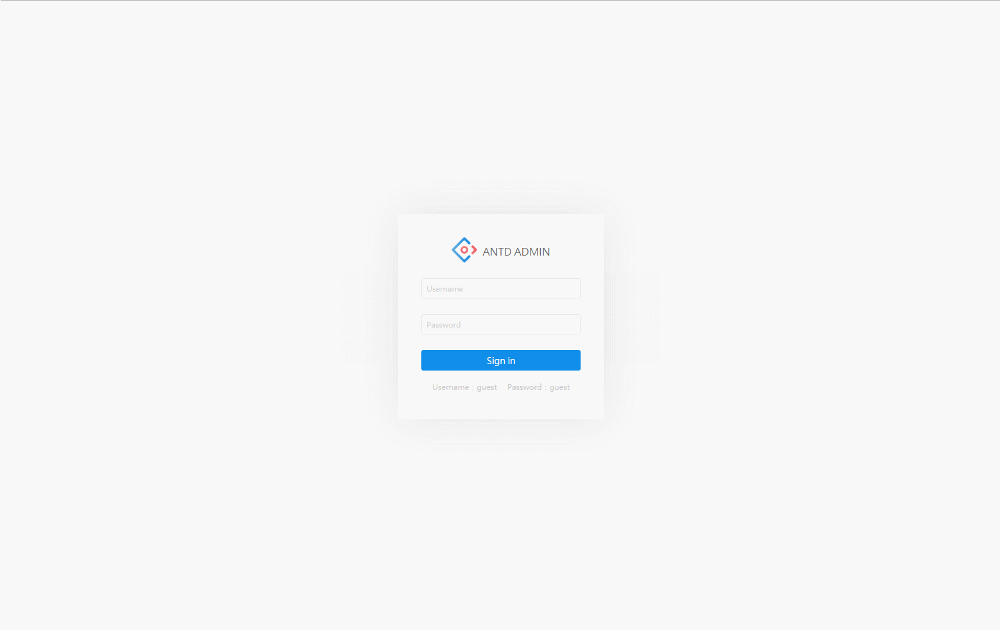
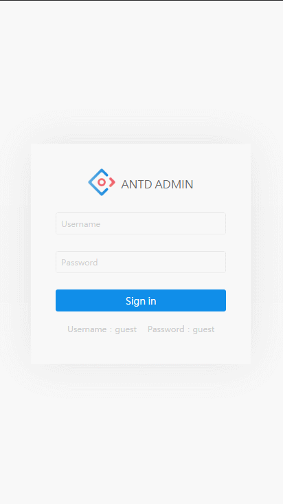

# Antd Admin

[](https://github.com/facebook/react)
[](https://github.com/ant-design/ant-design)
[](https://github.com/dvajs/dva)

[](https://github.com/zuiidea/antd-admin)
[](https://github.com/zuiidea/antd-admin/pulls)
[](http://opensource.org/licenses/MIT)
[](http://standardjs.com)

演示地址 <http://zuiidea.github.io/antd-admin>  \| [备用地址](http://47.92.30.98:8000)

## 特性

-   基于[react](https://github.com/facebook/react)，[ant-design](https://github.com/ant-design/ant-design)，[dva](https://github.com/dvajs/dva)，[Mock](https://github.com/nuysoft/Mock) 企业级后台管理系统最佳实践。
-   基于Antd UI 设计语言，提供后台管理系统常见使用场景。
-   基于[dva](https://github.com/dvajs/dva)动态加载 Model 和路由，按需加载。
-   使用[roadhog](https://github.com/sorrycc/roadhog)本地调试和构建，其中Mock功能实现脱离后端独立开发。
-   浅度响应式设计。

## 更新日志

### 4.2.2

`2017-06-01`

-     新增用户管理批量删除。[#320](https://github.com/zuiidea/antd-admin/issues/320)

### 4.2.1

`2017-05-12`

-     新增IconFont扩展方案,本地使用方案。[#270](https://github.com/zuiidea/antd-admin/issues/270) [Live](http://47.92.30.98:666/UIElement/iconfont)
-     新增常见场景使用loading。 [dva-loading](https://github.com/dvajs/dva-loading)

### 4.2

`2017-04-28`

-     修改user相关API使用`Restful`风格。
-     增加user页面多条件查询。[#266](https://github.com/zuiidea/antd-admin/issues/226)
-     修复菜单默认高亮。[#201](https://github.com/zuiidea/antd-admin/issues/201)

      [More Change Log](https://github.com/zuiidea/antd-admin/wiki/Change-Log)

## 开发构建

### 目录结构

```bash
├── /dist/           # 项目输出目录
├── /src/            # 项目源码目录
│ ├── /components/   # UI组件及UI相关方法
│ │ ├── skin.less    # 全局样式
│ │ └── vars.less    # 全局样式变量
│ ├── /routes/       # 路由组件
│ │ └── app.js       # 路由入口
│ ├── /models/       # 数据模型
│ ├── /services/     # 数据接口
│ ├── /themes/       # 项目样式
│ ├── /mock/         # 数据mock
│ ├── /utils/        # 工具函数
│ │ ├── config.js    # 项目常规配置
│ │ ├── menu.js      # 菜单及面包屑配置
│ │ ├── config.js    # 项目常规配置
│ │ ├── request.js   # 异步请求函数
│ │ └── theme.js     # 项目需要在js中使用到样式变量
│ ├── route.js       # 路由配置
│ ├── index.js       # 入口文件
│ └── index.html     
├── package.json     # 项目信息
├── .eslintrc        # Eslint配置
└── .roadhogrc.js    # roadhog配置
```

文件夹命名说明:

-   components：组件（方法）为单位以文件夹保存，文件夹名组件首字母大写（如`DataTable`），方法首字母小写（如`layer`）,文件夹内主文件与文件夹同名，多文件以`index.js`导出对象（如`./src/components/Layout`）。
-   routes：页面为单位以文件夹保存，文件夹名首字母小写（特殊除外，如`UIElement`）,文件夹内主文件以`index.js`导出，多文件时可建立`components`文件夹（如`./src/routes/dashboard`），如果有子路由，依次按照路由层次建立文件夹（如`./src/routes/UIElement`）。

### 快速开始

克隆项目文件:

    git clone https://github.com/zuiidea/antd-admin.git

进入目录安装依赖:

    npm i 或者 yarn install

开发：

```bash
npm run dev
打开 http://localhost:8000
```

构建：

```bash
npm run build

将会生成dist目录
```

代码检测：

```bash
npm run lint
```

项目部署 [#269](https://github.com/zuiidea/antd-admin/issues/269)

## 参考

用户列表：<https://github.com/dvajs/dva/tree/master/examples/user-dashboard>

dashboard设计稿：<https://dribbble.com/shots/3108122-Dashboard-Admin> （已征得作者同意）

## 截屏

web



移动


