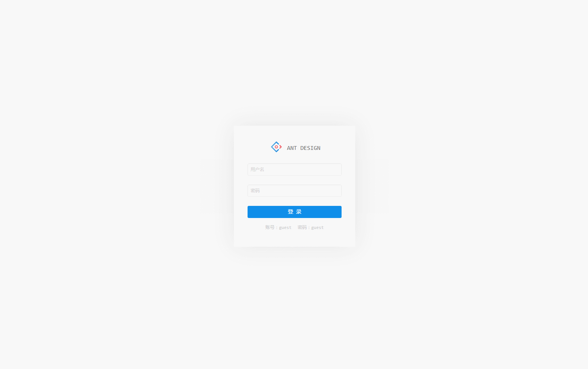
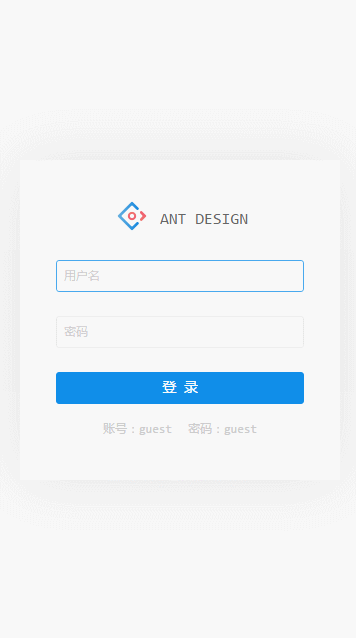

# Antd Admin

[](https://github.com/facebook/react)
[](https://github.com/ant-design/ant-design)
[](https://github.com/dvajs/dva)

[](https://github.com/zuiidea/antd-admin)
[](https://github.com/zuiidea/antd-admin/pulls)
[](http://opensource.org/licenses/MIT)
[](http://standardjs.com)

演示地址 <http://zuiidea.github.io/antd-admin/>

## 特性

-   基于[react](https://github.com/facebook/react)，[ant-design](https://github.com/ant-design/ant-design)，[dva](https://github.com/dvajs/dva)，[Mock](https://github.com/nuysoft/Mock) 企业级后台管理系统最佳实践
-   基于[Mock](https://github.com/nuysoft/Mock)实现脱离后端独立开发
-   基于Antd UI 设计语言，提供后台管理系统常见使用场景
-   基于[dva](https://github.com/dvajs/dva)动态加载 Model 和路由，按需加载
-   浅度响应式设计

## To do list

-   [x] 登录页面
-   [x] dashbord页面
    -   [x] 数字卡片
    -   [x] 实时天气卡片
    -   [x] 图表
-   [x] 用户列表页面
    -   [x] 增删改查
    -   [x] 交互动效
-   [x] 扩展UI组件
    -   [x] IconFont
    -   [x] DataTable
    -   [x] Search
    -   [x] DropOption
    -   [x] 基于Modal封装的layer方法
-   [x] 加入dva-loading
-   [x] 规范代码: EsLint; 自用[开发配置](assets/standard.md)
-   [ ] 数据可视化页面
-   [ ] 模拟消息收发
-   [ ] 升级dva-cli

## 开发及构建

### 目录结构

```bash
├── /mock/           # 数据mock的接口文件
├── /dist/           # 项目输出目录
├── /src/            # 项目源码目录
│ ├── /components/   # UI组件及UI相关方法
│ │ ├── skin.less    # 全局样式
│ │ └── vars.less    # 全局样式变量
│ ├── /routes/       # 路由组件
│ │ └── app.js       # 路由入口
│ ├── /models/       # 数据模型
│ ├── /services/     # 数据接口
│ ├── /utils/        # 工具函数
│ │ ├── config.js    # 项目常规配置
│ │ ├── menu.js      # 侧边菜单配置
│ │ ├── mock.js      # 数据拦截配置
│ │ ├── config.js    # 项目常规配置
│ │ ├── request.js   # 异步请求函数
│ │ └── theme.js     # 项目需要在js中使用到样式变量
│ ├── route.js       # 路由配置
│ ├── index.js       # 入口文件
│ └── index.html     
├── package.json     # 项目信息
└── proxy.config.js  # 数据mock配置
```

文件夹命名说明:

-   components：组件（方法）为单位以文件夹保存，文件夹名组件首字母大写（如`DataTable`），方法首字母小写（如`layer`）,文件夹内主文件与文件夹同名，多文件以`index.js`导出对象（如`./src/components/Layout`）
-   routes：页面为单位以文件夹保存，文件夹名首字母小写（特殊除外，如`UIElement`）,文件夹内主文件以`index.js`导出，多文件时可建立`components`文件夹（如`./src/routes/dashboard`），如果有子路由，依次按照路由层次建立文件夹（如`./src/routes/UIElement`）

### 快速开始

克隆项目文件:

    git clone https://github.com/zuiidea/antd-admin.git

进入目录安装依赖:

    npm i 或者 yarn install

开发：

```bash
npm run dev    # 使用mock拦截请求，数据存储在localStroge里

打开 http://localhost:8000
```

构建：

```bash
npm run build

将会生成dist目录
```

代码检测：

```bash
npm run lint
```

### 注意事项

-   生产环境中，已有数据接口，请将`src/utils/index.js`第四行 `require('./mock.js')`注释
-   开发环境中，如再mock目录新增文件，请在`src/utils/mock.js`第二行的`mockData`数组中添加
-   如需重写antd样式配置，请修改`src/theme.js`
-   项目配置文件在`src/utils/config.js`
-   如需重写异步请求函数，请修改`src/utils/request.js`
    （关于为什么使用axios而不是fetch：在一个无服务器的环境中模拟数据请求，[Mock](https://github.com/nuysoft/Mock)不能拦截Fetch）

## 参考

用户列表：<https://github.com/dvajs/dva/tree/master/examples/user-dashboard>

dashboard设计稿：<https://dribbble.com/shots/3108122-Dashboard-Admin> （已征得作者同意）

## 截屏

web



移动


