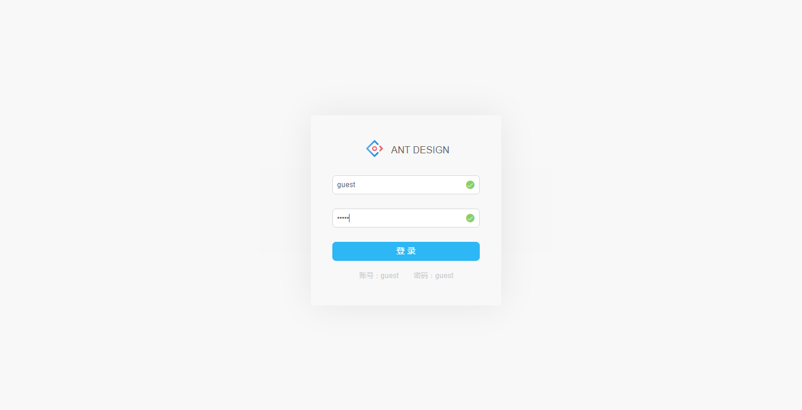
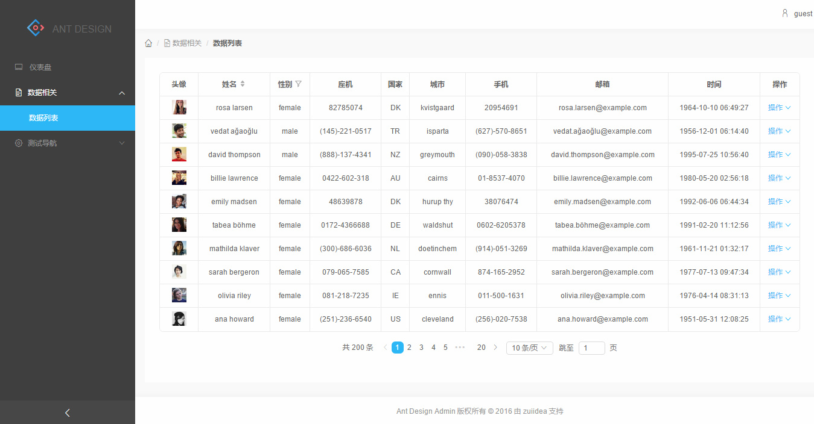

# 注意事项

2.0大体框架实现了，可以完全脱离后端开发，如果你需要的话，构建生成的静态项目可以mock数据，并存储在localStroge中。:smile:

接下来将会做一些功能完善和文档完善。:sweat_smile:

# to do list
- [ ] 登录示例
- [x] 主布局示例
- [x] 数据列表
- [ ] 表单相关
- [ ] 可视化图表


# antd-admin
开发脚手架 https://github.com/dvajs/dva

演示地址 http://zuiidea.github.io/antd-admin/

## 参考

https://github.com/jiangxy/react-antd-admin

https://github.com/dvajs/dva/tree/master/examples/user-dashboard

## 项目结构

```bash
├── /mock/           # 数据mock的接口文件
├── /src/            # 项目源码目录
│ ├── /components/   # 项目组件
│ ├── /routes/       # 路由组件
│ ├── /models/       # 数据模型
│ ├── /services/     # 数据接口
│ ├── /utils/        # 工具函数
│ ├── route.js       # 路由配置
│ ├── index.js       # 入口文件
│ ├── index.less     
│ └── index.html     
├── package.json     # 项目信息
└── proxy.config.js  # 数据mock配置
```
## Screenshot




