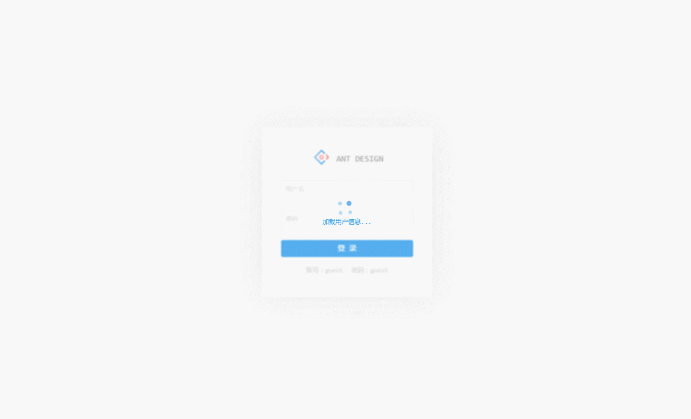

# Antd Admin

演示地址 http://zuiidea.github.io/antd-admin/

- 接下来将会做一些功能完善和文档完善。:sweat_smile:

## 特性

- 基于[React](https://github.com/facebook/react)，[Antd Design](https://github.com/ant-design/ant-design)，[dva](https://github.com/dvajs/dva)，[Mock](https://github.com/nuysoft/Mock) 企业级后台管理系统最佳实践。
- 基于[Mock](https://github.com/nuysoft/Mock)实现脱离后端独立开发。
- 基于Antd UI 设计语言，提供后台管理系统常见使用场景。

## to do list
- [x] 登录示例
- [x] 主布局示例
- [x] 数据列表
- [x] 表单相关
- [ ] dashbord首页
- [ ] 可视化图表

## 开发及构建

### 目录结构

```bash
├── /mock/           # 数据mock的接口文件
├── /dist/           # 项目输出目录
├── /src/            # 项目源码目录
│ ├── /components/   # 项目组件
│ ├── /routes/       # 路由组件
│ ├── /models/       # 数据模型
│ ├── /services/     # 数据接口
│ ├── /utils/        # 工具函数
│ ├── route.js       # 路由配置
│ ├── index.js       # 入口文件
│ └── index.html     
├── package.json     # 项目信息
└── proxy.config.js  # 数据mock配置

```

### 快速开始

克隆项目文件:

```
git clone git@github.com:zuiidea/antd-admin.git
```

进入目录安装依赖:

```
npm i
```

开发：

```bash
npm run dev    # 使用mock拦截请求，数据存储在localStroge里

打开：http://localhost:8000
```


构建：

```bash
npm run build

生成dist目录
```

## 参考

https://github.com/dvajs/dva/tree/master/examples/user-dashboard

## 截屏


